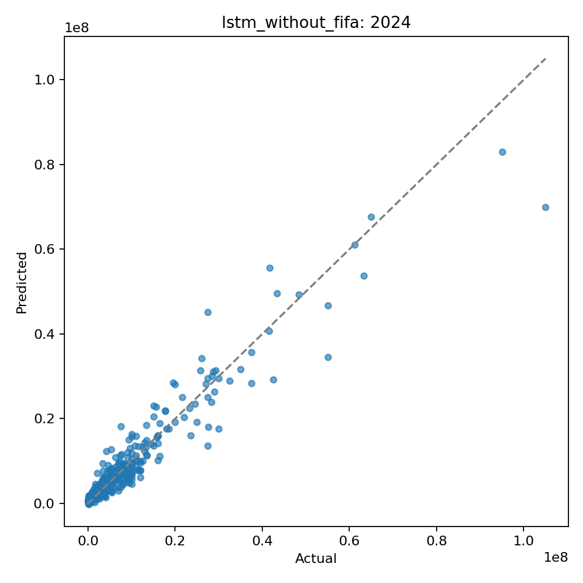
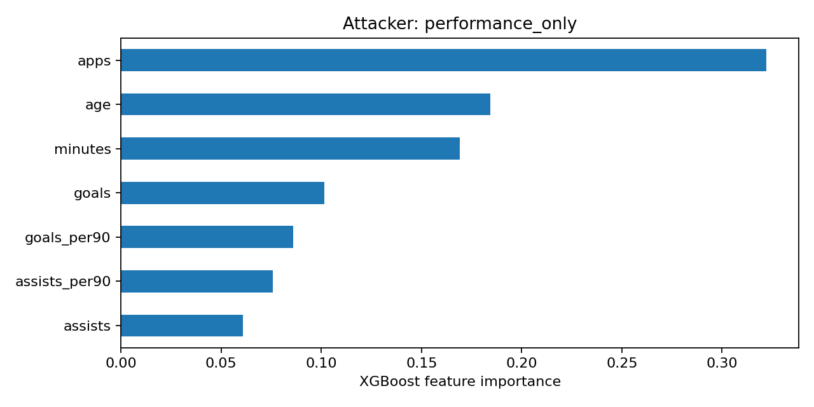
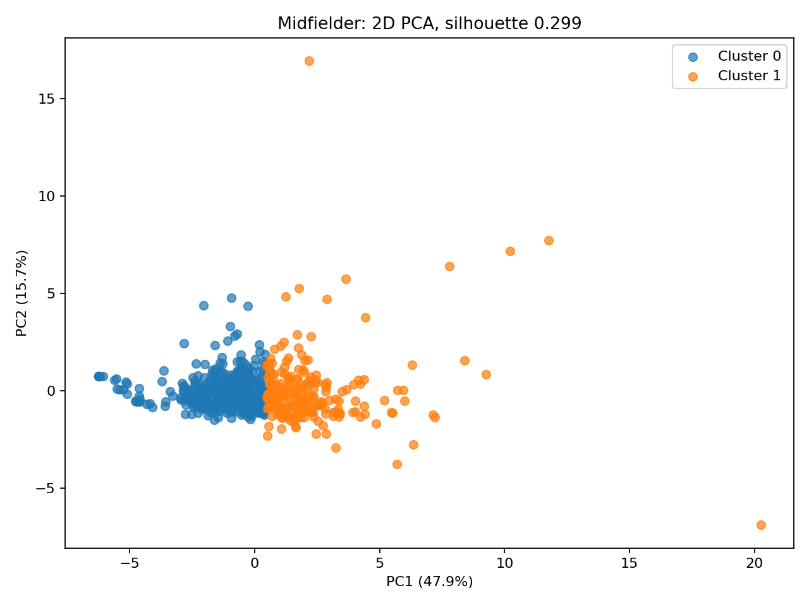

# Football Analytics and Market Value Forecasting

[](https://github.com/MarkousOriginal/football-analytics-portfolio/actions/workflows/tests.yml)

**Author: Markos Pantelis** · [GitHub](https://github.com/MarkousOriginal) · [LinkedIn](https://www.linkedin.com/in/pantelismarkos/)

Three machine-learning workflows on public football data, packaged as a tested
command-line project:

| Workflow | Question | Method |
| --- | --- | --- |
| Ratings | How much of a player's FIFA overall rating can match statistics explain? | Position-specific XGBoost, compared with a training-mean baseline |
| Scouting | Which statistical profiles exist within each position? | KMeans with silhouette-based choice of k, PCA visualization |
| Forecasting | Can a player's past seasons predict next year's market value? | PyTorch LSTM with attention, chronological holdout, persistence baseline |

## Key results

| Workflow | Result |
| --- | --- |
| Forecasting | LSTM reduces MAE by **36%** against a persistence baseline on 642 player-year forecasts in the 2024 holdout (R² 0.92 vs 0.84) |
| Ratings | Performance stats alone explain **41–65%** of FIFA overall for outfield players; adding FIFA attributes gives R² 0.90–0.98 |
| Scouting | 2,006 players clustered into 2–5 profiles per position (silhouette 0.19–0.30) |

### 1. Market-value forecasting (LSTM)

Each sample is a player's ten previous calendar years of market value, goals,
assists, minutes and appearances. The target is the player's mean market value in
the following year. Training uses target year 2022 (644 samples), early stopping
uses 2023 (698), and 2024 (642) is used once as the final test.

The split is by year, not by player. Each 2024 forecast is for a different player,
but 361 of those 642 players also appear as 2022 training samples. The result
measures forecasting a future year for known players, not generalization to
unseen players.

| Model | MAE | RMSE | R² | MAE vs persistence |
| --- | --- | --- | --- | --- |
| Persistence (last year's value) | €2.14M | €4.08M | 0.84 | — |
| **LSTM** | **€1.38M** | **€2.87M** | **0.92** | **−36%** |
| LSTM + FIFA 22 attention | €1.60M | €3.02M | 0.91 | −25% |



**FIFA attributes did not help.** Both LSTM variants used exactly the same players
and years, and the model conditioned on FIFA 22 attributes was less accurate than
the one using match history alone.

Every FIFA 22 row used is dated **2021-09-23** in the dataset's `update_as_of` column,
so the attributes are only used for target years from 2022 onwards. The code reads
these dates, records them in `run.json`, and stops if any row is dated after
`--fifa-observed-year`. This date comes from the Kaggle dataset; it shows when the
snapshot was taken, but cannot rule out later corrections made by the dataset's
compiler.

### 2. FIFA rating reconstruction (XGBoost)

Players are matched between Transfermarkt and FIFA 24 (update dated 2023-09-22) by
name, and a separate model
is trained for each position on 2023 statistics. Each model is evaluated on a 20%
player holdout.

| Position | Players | Training mean R² | Performance only R² | + FIFA attributes R² |
| --- | --- | --- | --- | --- |
| Attackers | 653 | −0.02 | 0.65 | 0.91 |
| Midfielders | 1,189 | 0.00 | 0.45 | 0.90 |
| Defenders | 1,074 | 0.00 | 0.41 | 0.90 |
| Goalkeepers | 279 | −0.04 | 0.01 | 0.98 |



Goals and assists say almost nothing about a goalkeeper's rating, and playing time
(appearances, minutes) and age matter more than scoring for outfield players. The
high scores with FIFA attributes mainly show that FIFA's overall rating is built
from those attributes. They are not evidence of predicting future performance.

### 3. Player profiling (KMeans + PCA)

Players from the 2022–23 season are grouped by their first listed position. Features
are standardized, and k between 2 and 6 is chosen by silhouette score.

| Position | Players | Clusters | Silhouette |
| --- | --- | --- | --- |
| Goalkeepers | 164 | 3 | 0.19 |
| Defenders | 825 | 3 | 0.23 |
| Midfielders | 608 | 2 | 0.30 |
| Attackers | 409 | 5 | 0.22 |



Silhouette values of 0.2–0.3 mean that the profiles overlap: player styles form a
continuum rather than separate types. Cluster IDs carry no meaning, so profiles are
interpreted from the cluster means in `results/scouting/`.

## Result files

The exact numbers above can be checked in [`results/`](results/), copied from the
runs that produced them:

| Folder | Files |
| --- | --- |
| [`results/forecast/`](results/forecast/) | `metrics.csv`, `run.json` (split sizes, test-player overlap with training, FIFA snapshot dates) |
| [`results/ratings/`](results/ratings/) | `metrics.csv` (all positions and variants), `run.json` (FIFA snapshot dates) |
| [`results/scouting/`](results/scouting/) | `run.json`, `<Position>_k_selection.csv` (silhouette for every k), `<Position>_cluster_means.csv` |

Rerunning the commands under [Usage](#usage) with the same data and the default
seed reproduces these metrics.

## Methodology

- **No leakage across time.** Forecasting uses disjoint calendar years for training,
  validation and test. Scalers are fit on training data only, and missing years are
  never treated as consecutive.
- **Baselines everywhere.** Every model is compared with a simple baseline on the
  same split: training mean for ratings and last year's value for forecasting.
- **Comparable ablations.** Models with and without FIFA features use identical
  samples, so the difference reflects the features alone.
- **Careful identity matching.** Players are matched across datasets with RapidFuzz.
  A match needs a score of at least 90 and a 5-point margin over the next candidate.
  Shared names and collisions are rejected and recorded in `match_audit.csv`.

## Data

The data is downloaded from Kaggle and is not included in this repository. Place the
CSV files in `data/`.

| File | Source |
| --- | --- |
| `players.csv`, `appearances.csv`, `player_valuations.csv` | [Football Data from Transfermarkt](https://www.kaggle.com/datasets/davidcariboo/player-scores) |
| `male_players.csv` | [EA Sports FC 24 complete player dataset](https://www.kaggle.com/datasets/stefanoleone992/ea-sports-fc-24-complete-player-dataset) (FIFA 15 – FC 24) |
| `2022-2023 Football Player Stats.csv` | [2022-2023 Football Player Stats](https://www.kaggle.com/datasets/vivovinco/20222023-football-player-stats) (FBref data) |

See each dataset page for its license and terms of use.

## Setup

Python 3.12 is tested; 3.10 or later is supported.

```powershell
python -m venv .venv
.venv\Scripts\Activate.ps1          # macOS/Linux: source .venv/bin/activate
python -m pip install -r requirements-tested.txt
python -m pip install -e .
python -m pip install torch==2.5.1 --index-url https://download.pytorch.org/whl/cpu
```

PyTorch is only needed for forecasting and for the full test suite.

## Usage

```bash
# Player profiling
python -m football_ml scouting --stats "data/2022-2023 Football Player Stats.csv" --output outputs/scouting

# FIFA rating reconstruction
python -m football_ml ratings --players data/players.csv --appearances data/appearances.csv --fifa data/male_players.csv --fifa-version 24 --performance-year 2023 --output outputs/ratings

# Market-value forecasting
python -m football_ml forecast --players data/players.csv --appearances data/appearances.csv --valuations data/player_valuations.csv --fifa data/male_players.csv --fifa-version 22 --fifa-observed-year 2021 --output outputs/forecast
```

Run `python -m football_ml <command> --help` for all options. Leave out `--fifa`,
`--fifa-version` and `--fifa-observed-year` to run the forecast without FIFA data.
Each run writes metrics, predictions, plots, fitted models and a `run.json` with
its settings to the output folder.

## Tests

```bash
python -m unittest discover -s tests -v
```

The tests check position parsing, name collisions, FIFA edition handling,
chronological windows, split disjointness, training-only scaling and FIFA snapshot
dates. An integration
test runs all three workflows end to end on generated data. GitHub Actions runs the
suite on every push.

## Limitations

- Calendar years are used instead of football seasons.
- The forecast needs ten consecutive years of history, so it covers experienced
  players only.
- The forecast holdout is a future year, not a set of unseen players.
- FIFA snapshot dates are taken from the Kaggle dataset and are not independently
  verified.
- Name-based matching can still produce occasional false matches.
- The scouting features mix season totals with per-90 rates, and the ranking
  weights in `scouting_results.csv` are hand-chosen rather than learned.

## License

[MIT](LICENSE)
